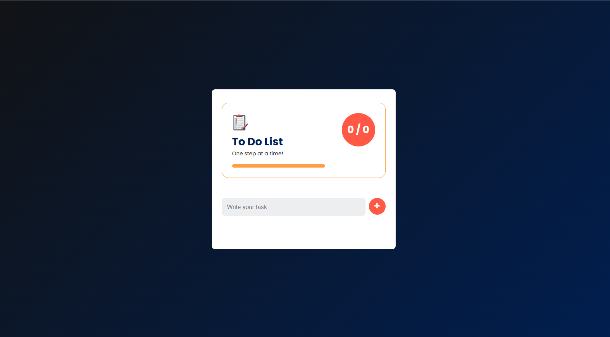

# To Do List

### Desktop

## Content

This is a To do List app I created based on a youtube video done by [Great Stack](https://youtu.be/-oP7JK_rXUI?si=YtfyQ5bXFYwXOUqF).

I followed the video to create the app the way he specified then I adjusted it to be custom based on some additions I wanted to add or elements I wanted to improve. The things I changed are below:

1. Made it responsive
2. Change the colour theme and icons
3. Changed what happens on hover with multiple elements
4. There were a number of things left out, in the youtube video, that meant I had to do a lot of work to get this to work as outlined in the video so I did a lot of clean up work to ensure the code worked as intended.
5. Got the progress bar and numbers to store in local storage (previously it as just the tasks)

You can check out more about me and my services at: [Timely Web Design](https://www.timelywebdesign.com/).
